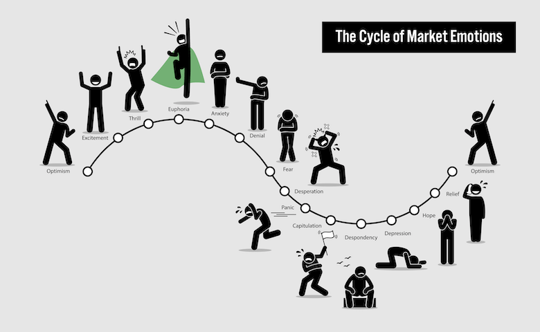

# Data Science Portfolio
---
## Machine learning

### Lending Club Case Study

Case Study on potential loan defaulters and EDA on figuring out the drivers behind credit default 

---

### Stock Sentiment Detector

First time, working with NLP. This is a simple classification problem which determines based on the text, whether it reflects 'BEARISH' or 'BULLISH' sentiment in the market

---
### Tradebots Financial Portfolio Evaluator

This is a trading script developed in Python, Yahoo Finance and other libraries where by passing one or more stock tickers in the Indian stock market and weightages, one can backtest and figure out a fair amount of profitability on them

